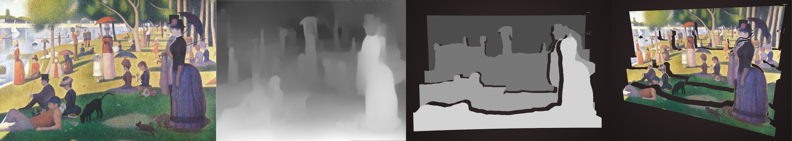

# Depth Painter

This software renders a 3D parallax effect of a canvas image by means of k-means unsupervised color clustering applied on its corresponding depth map.

## Dependencies

[OpenFrameworks](https://openframeworks.cc), including addons [ofxOpenCv](https://github.com/openframeworks/openFrameworks/tree/master/addons/ofxOpenCv), this [ofxCv](https://github.com/valillon/ofxCv), and optionally [ofxLeapMotion](https://github.com/ofTheo/ofxLeapMotion) to navigate through.

## Camera projection

A focal projection locates the points (pixels) in the 3D space according to:

- `focal`: distance from the camera to the canvas.
- `extrusion`: separation factor applied to the canvas depth range.

High focal values converge the projection to a parallel projection.

## Sources

This repository does not contain images or depth maps.		
Be sure to include your own sources in `/bin/data` and load them properly in `setupAudio()` and `loadExample()`.	
Awesome depth maps can be generated with [MegaDepth](https://github.com/lixx2938/MegaDepth).	

## Notes

Comment the macro `LEAP_MOTION_ON` to disable undesired functionalities.	
After launching the app, type `h` for a complete list of key-stroke actions.		

---
Rafael Redondo (c) 2020.

