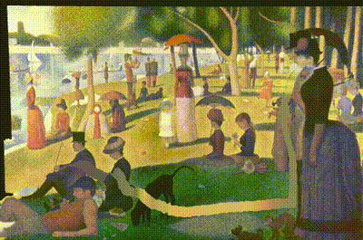

# Depth Parallax Painter

This code renders a 3D parallax effect from a canvas image and its corresponding depth map by means of the k-means unsupervised color clustering.

To inpaint deocclusions caused by the parallax effect a simple method such as Navier-Strokes is used here. For simplicity, the background plane is solely inpainted here. A more appealing inpainting could be generated by recurrently masking different areas with a combination of one or several depth planes. However, this depends on the intrinsic geometry of each picture, so it cannot be fully automated. Nevertheless, this code can be easily modified for such a purpose.

This got inspiration from the awesome and brilliant works [3D Ken Burns](https://github.com/sniklaus/3d-ken-burns) and [3D Photography](https://shihmengli.github.io/3D-Photo-Inpainting).

## Dependencies

[OpenFrameworks](https://openframeworks.cc), including the addons [ofxOpenCv](https://github.com/openframeworks/openFrameworks/tree/master/addons/ofxOpenCv), this [ofxCv](https://github.com/valillon/ofxCv), and optionally [ofxLeapMotion](https://github.com/ofTheo/ofxLeapMotion) to navigate through.

This implementation derives from [DepthPainter](https://github.com/valillon/depthpainter).

## Sources

This repository does not contain images or depth maps.		
Be sure to include your own sources in `/bin/data` and load them properly in `loadExample()`.	
Awesome depth maps can be generated with [MegaDepth](https://github.com/lixx2938/MegaDepth).	

## Notes

Comment the macro `LEAP_MOTION_ON` to disable undesired functionalities.	
After launching the app, type `h` for a complete list of key-stroke actions.		

---
Rafael Redondo (c) 2020.